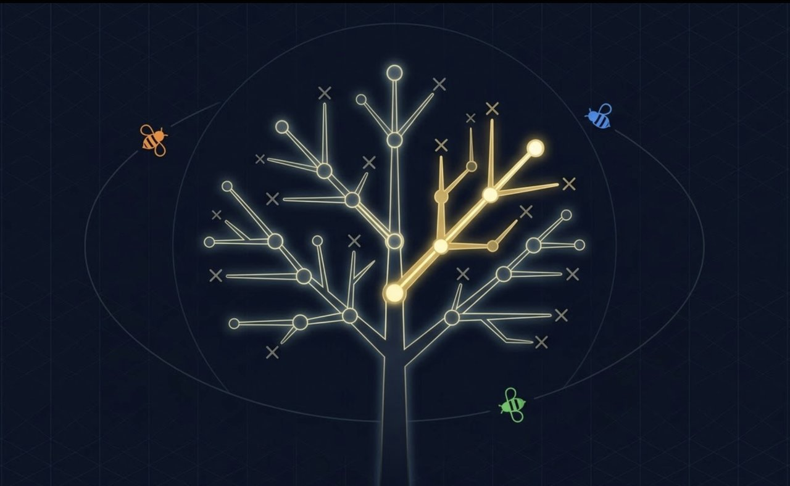
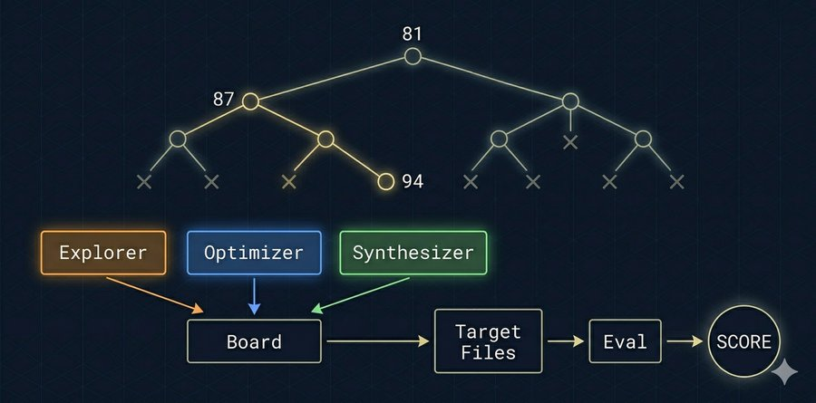
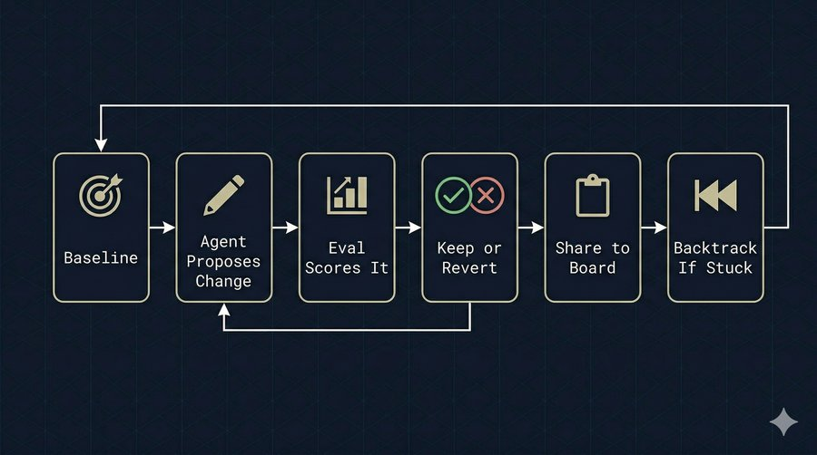
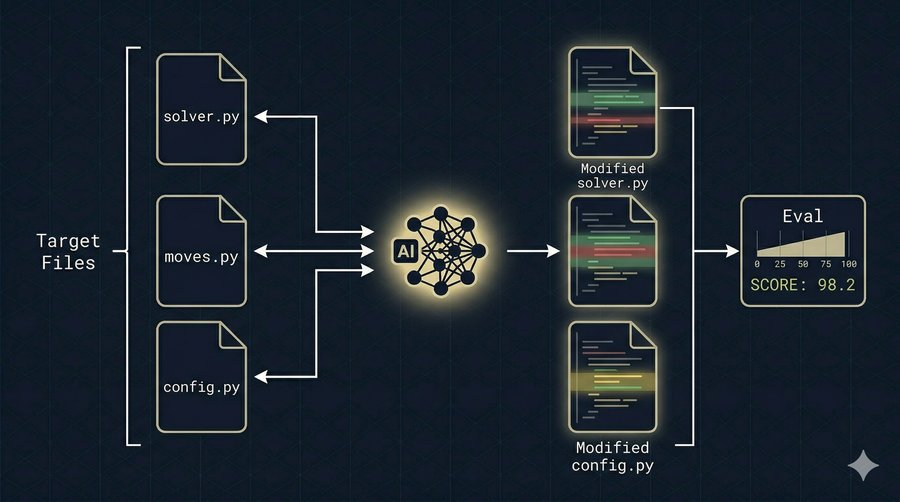

<div align="center">



# 🐝 SwarmResearch

**Autonomous multi-agent optimization with tree search & backtracking**

*A swarm of AI agents collaboratively optimize any file against a measurable metric — and backtrack when stuck in local optima.*

[](https://github.com/ac1b/swarm-research/stargazers)
[](LICENSE)
[](https://python.org)
[](#-tests)

Inspired by [Karpathy's autoresearch](https://github.com/karpathy/autoresearch) and [MiroFish](https://github.com/666ghj/MiroFish).

</div>

---

<div align="center">

<br><sub>Game-AI example: Othello bot 25% → 100% win rate in 6 rounds with backtracking</sub>
</div>

---

## ⚡ What is this?

Most auto-research tools use a **greedy ratchet** — keep improvements, revert everything else. This gets stuck in local optima fast.

SwarmResearch adds **tree search with backtracking**: when agents hit a plateau, the engine rolls back to an earlier state and explores a different optimization path. Combined with multiple agents (Explorer, Optimizer, Synthesizer) sharing findings via a board, this escapes local optima that single-path approaches can't.

> **Input:** target file(s) + an eval script that outputs a score
> **Output:** optimized file(s) + a tree of explored paths

## 🏗️ Architecture

<div align="center">

</div>

## 🔄 How it works

<div align="center">

</div>

1. **Baseline** — eval the target file, record the starting score
2. **Agents take turns** — each proposes a change (full rewrite or SEARCH/REPLACE diff)
3. **Eval & decide** — if score improves, keep the change; otherwise revert
4. **Share findings** — all results (kept and reverted) go to the shared board
5. **Backtrack if stuck** — after N stale rounds, roll back to an earlier state in the tree and try a different path
6. **Restore global best** — at the end, the best result across all branches is restored

## 🚀 Quick start

```bash
git clone https://github.com/ac1b/swarm-research.git
cd swarm-research
pip install -e .

# Configure LLM
cp .env.example .env
# Edit .env with your API key

# Run speed optimization example
python3 run.py examples/speed-opt/task.md

# With backtracking (escape local optima)
python3 run.py examples/speed-opt/task.md --rounds 10 --backtrack 3
```

## 📋 Configuration

Create a `task.md` with YAML frontmatter:

```yaml
---
target: target/solution.py
eval: python3 eval.py
direction: maximize
rounds: 10
backtrack: 3
max_backtracks: 5
---

Description of what to optimize and any constraints.
```

Multi-file target:

```yaml
target: [target/solver.py, target/moves.py, target/config.py]
```

### Options

| Key | Default | Description |
|-----|---------|-------------|
| `target` | *required* | Path to file(s) agents modify. List for multi-file: `[a.py, b.py]` |
| `eval` | *required* | Command that outputs a numeric score |
| `direction` | `maximize` | `maximize` or `minimize` the score |
| `rounds` | `10` | Number of optimization rounds |
| `timeout` | `300` | Eval timeout in seconds |
| `eval_runs` | `1` | Runs per eval (median used for >1) |
| `mode` | `auto` | `full` = rewrite, `diff` = SEARCH/REPLACE, `auto` = diff if >50 lines |
| `parallel` | `false` | Run agents in parallel (best result wins each round) |
| `early_stop` | `0` | Stop after N stale rounds (0 = disabled) |
| `backtrack` | `0` | Backtrack after N stale rounds (0 = disabled) |
| `max_backtracks` | `5` | Maximum number of backtracks per run |

### CLI overrides

```bash
python3 run.py task.md --rounds 15 --backtrack 3 --max-backtracks 5
python3 run.py task.md --parallel --early-stop 3 --mode diff
python3 run.py task.md --eval-runs 3 --timeout 60 --no-report
```

All YAML options can be overridden from the command line:

| Flag | Description |
|------|-------------|
| `--rounds N` | Number of optimization rounds |
| `--backtrack N` | Backtrack after N stale rounds |
| `--max-backtracks N` | Max backtracks per run |
| `--parallel` | Run agents in parallel |
| `--early-stop N` | Stop after N stale rounds |
| `--mode {full,diff,auto}` | Code edit mode |
| `--eval-runs N` | Eval runs to average |
| `--timeout N` | Eval timeout (seconds) |
| `--no-report` | Skip LLM report generation |

## 📊 Results

### speed-opt example

Optimize a Python function for maximum throughput (Kimi K2.5, 10 rounds, backtrack=3):

```
Baseline:   81 ops/sec

ROUND 1  │ Explorer  KEPT  score=87.12  (+6.0)   ← sqrt elimination
ROUND 3  │ Explorer  KEPT  score=94.40  (+7.3)   ← refined approach
ROUND 4-6│ all reverted... plateau
         │ BACKTRACK #1: 94.40 → 87.12 (trying different path)
ROUND 7  │ Synth     KEPT  score=94.20  (+7.1)   ← found alternative!
ROUND 8-10 all reverted... plateau
         │ BACKTRACK #2: 94.20 → 94.40 (restored global best)

DONE
  Final:      94.40 ops/sec (+16.4%)
  Tree nodes: 4
  Backtracks: 2
```

### game-ai example (Othello AI, 2 files)

Build an Othello AI to beat 4 opponents — random, greedy, positional, minimax (Kimi K2.5, 1 round):

```
Baseline:   25.62 (random moves)

ROUND 1  │ Optimizer KEPT  score=45.00  (+19.4)   ← positional weights
         │ Synth     KEPT  score=60.62  (+15.6)   ← mobility + corner eval

DONE
  Final:      60.62 (+136.6%)
```

### scheduler example (3 files, minimize, parallel)

Minimize weighted tardiness on 5 job shop instances — 10 to 50 jobs (Kimi K2.5, 3 rounds):

```
Baseline:   213,837 (FIFO dispatching)

ROUND 1  │ Optimizer KEPT  score=69,053   (-67.7%)  ← EDD dispatching
ROUND 2  │ Optimizer KEPT  score=63,422   (-70.3%)  ← weighted slack priority
ROUND 3  │ Synth     KEPT  score=60,617   (-71.7%)  ← refined heuristics

DONE
  Final:      60,617 (-71.7%)
```

### tsp-opt example (3 files, minimize, diff mode)

40-city TSP across 3 files — solver, moves, config (Kimi K2.5, 3 rounds):

```
Baseline:   592.71 (nearest-neighbor + random swaps)

ROUND 1  │ Synth     KEPT  score=497.66  (-16.0%)  ← 2-opt local search
ROUND 2-3│ all reverted... plateau

DONE
  Final:      497.66 (-16.0%)
```

## 🧬 Key features

| Feature | Description |
|---------|-------------|
| **Tree search** | States form a tree, not a line. Backtrack to explore branches. |
| **Global best tracking** | Best result across all branches is restored at the end. |
| **Multi-agent swarm** | Explorer (bold), Optimizer (careful), Synthesizer (combines ideas). |
| **Shared board** | All agents see what worked and what failed. No repeated mistakes. |
| **Phase-aware prompts** | Agents know if it's early exploration or late refinement. |
| **Per-agent memory** | Each agent remembers its own experiment history. |
| **Resume** | Crash? Just re-run. Picks up from `board.json` + `tree.json`. |
| **Multi-file targets** | Optimize across multiple files simultaneously. `target: [a.py, b.py]` |
| **Diff mode** | For large files: SEARCH/REPLACE blocks instead of full rewrites. |
| **Any LLM** | Anthropic, OpenAI, or any OpenAI-compatible API. |

### Multi-file optimization

<div align="center">

</div>

Agents see all target files, modify any or all of them, and eval runs against the full set. Algorithm + config + helpers can be optimized together.

## 🔧 Custom agents

Create `agent_prompts.py` next to your `task.md`:

```python
from engine import AgentConfig

AGENTS = [
    AgentConfig("Researcher", "Explore novel approaches. Be creative.", 0.9),
    AgentConfig("Engineer", "Make precise, incremental improvements.", 0.3),
]
```

## 🌐 Supported LLM providers

| Provider | Config |
|----------|--------|
| **Anthropic** (Claude) | `LLM_PROVIDER=anthropic` |
| **OpenAI** (GPT-4o) | `LLM_PROVIDER=openai` |
| **Kimi Code** (K2.5) | `LLM_PROVIDER=anthropic`, `LLM_BASE_URL=https://api.kimi.com/coding/` |
| **Any OpenAI-compatible** | `LLM_PROVIDER=openai`, set `LLM_BASE_URL` |

## 🧪 Tests

```bash
python3 -m pytest tests/ -v          # all 90 tests
python3 -m pytest tests/test_tree.py  # SearchTree unit tests (35)
python3 -m pytest tests/test_backtrack_engine.py  # engine integration (22)
python3 -m pytest tests/test_multifile.py  # multi-file target tests (33)
```

## 📁 Project structure

```
swarm-research/
├── engine.py              # Core engine (~1400 lines)
├── run.py                 # CLI entry point
├── .env.example           # LLM config template
├── docs/images/           # README images + demo GIF
├── tests/
│   ├── test_tree.py       # SearchTree unit tests
│   ├── test_backtrack_engine.py
│   ├── test_multifile.py  # Multi-file target tests
│   └── conftest.py
├── examples/              # 11 benchmark tasks
│   ├── speed-opt/         # Python function speed optimization
│   ├── tsp-opt/           # 40-city TSP (3 files)
│   ├── multi-opt/         # Multi-file sorting
│   ├── algo-opt/          # Bin packing optimization
│   ├── config-opt/        # Cache configuration tuning
│   ├── compress-opt/      # Compression from scratch
│   ├── bio-opt/           # DNA motif discovery
│   ├── num-opt/           # Numerical integration
│   ├── game-ai/           # Othello AI vs 4 opponents (2 files)
│   ├── ml-opt/            # Neural net from scratch (2 files)
│   └── scheduler/         # NP-hard job shop scheduling (3 files)
├── experiments/           # Ablation scripts + results (100 runs)
└── paper/                 # NeurIPS workshop paper draft
```

## 🔮 Roadmap

- [x] Multi-file targets — optimize across multiple files simultaneously
- [x] Tree search with backtracking — escape local optima
- [x] Parallel agent execution — 2.6x speedup
- [x] 11 benchmark examples with baselines
- [x] Ablation study — 100 runs across 4 benchmarks
- [ ] Agent evolution — bad strategies die, good ones mutate and reproduce
- [ ] Smart scheduling — board influences which agent goes next

## 📄 License

MIT
