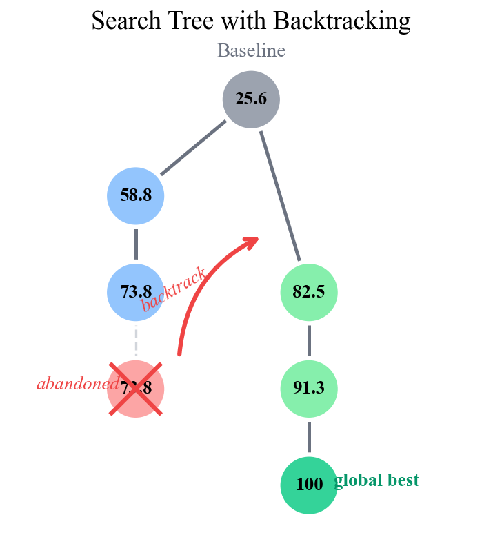
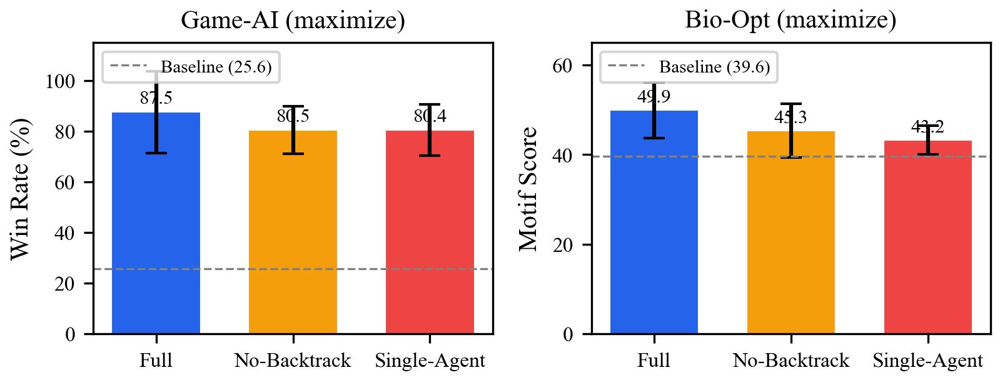
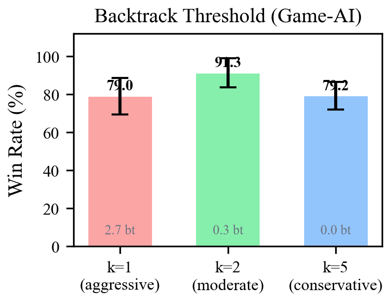
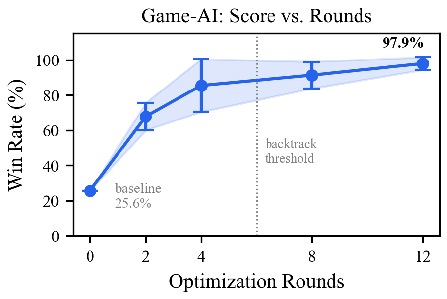

# Multi-Agent LLM Code Optimization with Tree Search and Shared Memory

## Abstract

We present **SwarmOpt**, a framework for automated code optimization that combines multiple LLM agents with tree search and a shared memory board. Given a target program and a numeric evaluation function, SwarmOpt iteratively generates code modifications through diverse agents---each with a distinct optimization strategy and sampling temperature---that share findings via a persistent board. When optimization stalls, a backtracking mechanism restores promising earlier states and redirects search to unexplored regions of the solution space. Across four benchmarks (game AI, bioinformatics, job scheduling, and TSP), the full system achieves up to +282% improvement over baselines. Ablations over 100 runs show that multi-agent diversity contributes up to 2.8x larger gains than single-agent search, and tree-based backtracking adds +27% relative improvement on complex tasks. Parallel execution provides 2.6x wall-clock speedup with no quality loss.

---

## 1. Introduction

Large language models (LLMs) can generate and modify code at human level [1], yet their application to *iterative code optimization*---repeatedly improving a program against a quantitative objective---remains underexplored. Prior work has shown that LLMs can discover novel algorithms through evolutionary search [2] or improve code via self-refinement [3], but these approaches typically use a single model in a linear chain of revisions, risking convergence to local optima.

We identify three limitations of single-agent iterative optimization:

1. **Strategy collapse**---a single agent tends to repeat similar modifications, exhausting one region of the solution space.
2. **No recovery from dead ends**---once a promising direction stalls, there is no mechanism to backtrack.
3. **No knowledge transfer**---failed attempts are discarded rather than informing future exploration.

SwarmOpt addresses these limitations through three mechanisms:

- **Agent diversity.** Multiple agents with distinct strategies and sampling temperatures reduce strategy collapse.
- **Shared memory board.** A persistent board records all experiments, enabling cross-agent knowledge transfer and failure avoidance.
- **Tree search with backtracking.** The optimization trajectory is maintained as a tree of program states. When progress stalls, the system backtracks to a high-scoring unexplored node (Figure 1).

We evaluate on four diverse benchmarks and conduct systematic ablations (100 runs total) isolating each component's contribution. On complex tasks, the full system significantly outperforms both single-agent and no-backtracking variants.

---

## 2. Related Work

**LLM-based code optimization.** FunSearch [2] evolves mathematical programs via LLMs, maintaining a population of solutions ranked by fitness. AlphaCode [1] generates massive candidate pools and filters via execution. EvoPrompting [4] combines evolutionary search with LLM mutation for neural architecture search. These approaches use flat populations; SwarmOpt maintains a *structured search tree* enabling targeted backtracking to promising states.

**Multi-agent LLM systems.** ChatDev [5] and MetaGPT [6] assign specialized roles in software development pipelines. Multi-agent debate [7] improves reasoning through discussion. AgentCoder [8] separates generation from testing. These systems optimize for *correctness* through role specialization; SwarmOpt optimizes a *numeric objective* with strategy-diverse agents sharing results through a common board.

**Search and self-refinement.** Tree of Thoughts [9] applies tree search to LLM reasoning at the thought-step level. Reflexion [10] uses verbal self-reflection; Self-Refine [3] iterates generation and critique. Large Language Monkeys [11] scales inference via repeated sampling. Our tree search operates at the *program state* level, with backtracking restoring actual file contents rather than reasoning steps.

---

## 3. Method

### 3.1 Problem Formulation

Given target source files **f** = {f1, ..., fm}, an evaluation function eval(**f**) -> R, and a direction d in {maximize, minimize}, find **f*** optimizing eval(**f***). The evaluation function is a black-box executable returning a numeric score.

### 3.2 Multi-Agent Architecture

The system maintains N agents, each defined by a strategy description and a sampling temperature. The default pool uses three agents:

- **Explorer** (temp=0.9) --- bold, creative approaches
- **Optimizer** (temp=0.3) --- focused, incremental improvements
- **Synthesizer** (temp=0.6) --- combines insights from the board

In **sequential mode**, agents run in order. Each sees the latest file state (including changes kept by earlier agents in the same round), the board, and its own memory. Kept changes accumulate; reverted changes inform the board.

In **parallel mode**, agents receive the same snapshot and run concurrently in isolated copies; the best improvement is committed. This trades the sequential cascade for wall-clock speedup.

### 3.3 Shared Memory Board

The board persistently stores every experiment result: agent, round, score, delta, kept/reverted status, and a change summary. It provides two views injected into prompts:

1. **Success history** --- all kept changes with scores
2. **Failure blocklist** --- reverted changes with an explicit "do not retry" instruction

This enables cross-agent knowledge transfer: an Explorer's algorithmic discovery informs the Optimizer's refinement.

### 3.4 Tree Search with Backtracking



*Figure 1: Search tree with backtracking. Nodes store program states and scores. When the left branch stalls (abandoned), the system backtracks to an earlier node and explores a new direction, ultimately finding the global best.*

The optimization trajectory forms a tree T where each node v stores a file state, score, creating agent, and visit metadata. Kept modifications add child nodes; the active pointer advances to the new child.

**Backtrack trigger.** A counter tracks consecutive stale rounds (no improvement). When stale rounds >= k, the system backtracks.

**Node selection.** The target is selected by scoring all nodes not on the current root-to-active path:

```
priority(v) = score(v) * 1/(1 + visits(v)) * penalty
  where penalty = 0.3 if abandoned, 1.0 otherwise
```

This balances exploitation (high scores) with exploration (fewer visits) while penalizing abandoned branches---analogous to UCB in MCTS [12], but over program states rather than game actions.

**State restoration.** On backtrack, the current branch is marked abandoned, files are restored to the target node, and agents receive context describing abandoned branches to encourage divergence. A global best is tracked across all branches and restored at termination.

---

## 4. Experiments

### 4.1 Setup

We evaluate on four tasks of varying complexity:

| Task | Description | Files | Metric | Baseline |
|------|-------------|-------|--------|----------|
| **Game-AI** | Othello agent vs. 4 opponents | 2 | Win rate (%) max | 25.6% |
| **Bio-Opt** | DNA motif finding | 1 | F1-like score max | 39.6 |
| **Scheduler** | Job shop, 50 jobs x 10 machines | 3 | Weighted tardiness min | 213,837 |
| **TSP** | 40-city traveling salesman | 3 | Tour distance min | 592.7 |

All experiments use Kimi K2.5 as the LLM, 6 rounds, 3 default agents, backtrack threshold k=3, max backtracks=5. Each config runs n=3--7 times. We report mean +/- std and improvement over baseline.

### 4.2 Component Ablation

We compare **Full** (3 agents + backtracking), **No-Backtrack** (3 agents, k=0), and **Single-Agent** (Explorer only, with backtracking).

| Task | Config | Baseline | Mean +/- Std | Delta% |
|------|--------|----------|-------------|--------|
| **Game-AI** | Full | 25.6 | **87.5 +/- 16.1** | +241% |
| | No-Backtrack | 25.6 | 80.5 +/- 9.4 | +214% |
| | Single-Agent | 25.6 | 80.4 +/- 10.1 | +214% |
| **Bio-Opt** | Full | 39.6 | **49.9 +/- 6.2** | +26% |
| | No-Backtrack | 39.6 | 45.3 +/- 6.0 | +14% |
| | Single-Agent | 39.6 | 43.2 +/- 3.2 | +9% |
| **Scheduler** | Full | 213,837 | 87,697 +/- 25,737 | -59% |
| | No-Backtrack | 213,837 | **84,963 +/- 24,849** | -60% |
| | Single-Agent | 213,837 | 100,225 +/- 27,762 | -53% |
| **TSP** | Full | 592.7 | **494.8 +/- 2.5** | -17% |
| | No-Backtrack | 592.7 | 497.6 +/- 4.5 | -16% |
| | Single-Agent | 592.7 | 495.6 +/- 0.5 | -16% |

*Table 1: Component ablation. Best mean per task in bold. Game-AI and Scheduler: n=7; Bio-Opt and TSP: n=3.*



*Figure 2: Component ablation on Game-AI and Bio-Opt. Full system (blue) consistently outperforms No-Backtrack (orange) and Single-Agent (red). Dashed lines show baselines. Error bars: +/- 1 std.*

**Multi-agent diversity.** Across all tasks, multi-agent configs outperform Single-Agent. The effect is strongest on Bio-Opt: Full achieves +26% vs. Single-Agent's +9%---a 2.8x larger gain. On Scheduler, multi-agent configs reduce tardiness by ~60% vs. 53%. On Game-AI, Full reaches 100% win rate in 4/7 runs vs. 1/7 for both alternatives.

**Backtracking.** On Game-AI, Full outperforms No-Backtrack by +27% relative (87.5 vs. 80.5; Cohen's d=0.53). On Bio-Opt, the gap is +12% relative. On Scheduler and TSP, backtracking adds minimal benefit---these tasks either have smooth landscapes (TSP) or high variance that masks the signal (Scheduler).

### 4.3 Backtrack Threshold and Round Scaling



*Figure 3a: Backtrack threshold k (n=3, 6 rounds). Moderate k=2 is optimal; aggressive (k=1) wastes rounds on frequent restarts.*

| k | Mean +/- Std | Avg Backtracks | Delta% |
|---|-------------|----------------|--------|
| 1 (aggressive) | 79.0 +/- 9.5 | 2.7 | +208% |
| 2 (moderate) | **91.3 +/- 7.6** | 0.3 | +256% |
| 5 (conservative) | 79.2 +/- 7.3 | 0.0 | +209% |

*Table 2: Backtrack threshold on Game-AI.*

Setting k=1 triggers 2.7 backtracks per run, wasting rounds on state restoration. Setting k=5 never triggers within 6 rounds, effectively disabling the mechanism. The moderate k=2 is optimal.



*Figure 3b: Score vs. optimization rounds (n=3, full config). Main gains at 2--4 rounds; backtracking extends progress at 8+.*

| Rounds | Mean +/- Std | Delta% | Backtracks | Wall Time |
|--------|-------------|--------|------------|-----------|
| 2 | 67.7 +/- 7.8 | +164% | 0.0 | 7 min |
| 4 | 85.4 +/- 15.0 | +233% | 0.0 | 12 min |
| 8 | 91.3 +/- 7.6 | +256% | 1.3 | 24 min |
| 12 | **97.9 +/- 3.6** | +282% | 1.3 | 51 min |

*Table 3: Score vs. rounds on Game-AI.*

The largest marginal gain is from 2 to 4 rounds (+18 points). Backtracking activates at round 8+ (threshold k=3), providing continued gains that push the system to 97.9% at 12 rounds (2/3 runs at 100%).

### 4.4 Parallel Execution

Sequential and parallel modes achieve identical quality on Game-AI (81.7 +/- 6.9 vs. 81.5 +/- 6.3) while parallel provides **2.6x wall-clock speedup** (429s vs. 1122s, n=3). Parallel mode selects the best among concurrent proposals, compensating for loss of the sequential improvement cascade.

---

## 5. Discussion and Limitations

**Task-dependent contributions.** Component contributions vary by task. Multi-agent diversity helps consistently across all benchmarks. Backtracking helps most on complex tasks with rugged landscapes (Game-AI) but adds little when the LLM quickly finds known heuristics (TSP). The shared board enables knowledge transfer but can hurt when early failures dominate the context; selective summarization could help.

**Relation to MCTS.** The node selection formula resembles UCB in MCTS [12, 13], but our setting differs: each "move" is an LLM-generated code modification---high-cost, non-deterministic, and open-ended---versus MCTS's well-defined action spaces. Backtracking is coarser-grained, restoring full program states.

**Limitations.** We use a single LLM (Kimi K2.5); results may differ with other models. Sample sizes (n=3--7) limit statistical power for high-variance tasks. The framework treats evaluation as a scalar black box, missing richer feedback (test breakdowns, execution profiles). The node selection formula uses fixed coefficients; adaptive tuning may improve performance.

---

## 6. Conclusion

SwarmOpt combines multi-agent diversity, shared memory, and tree-based backtracking for LLM-driven code optimization. Across four benchmarks, it achieves up to +282% improvement, with ablations confirming that each component contributes meaningfully on complex tasks. The framework is task-agnostic---any program with a numeric evaluation function can be optimized---and supports both sequential and parallel execution.

---

## References

1. Li et al. "Competition-level code generation with AlphaCode." Science, 2022.
2. Romera-Paredes et al. "Mathematical discoveries from program search with large language models." Nature, 2024.
3. Madaan et al. "Self-Refine: Iterative Refinement with Self-Feedback." NeurIPS, 2023.
4. Chen et al. "EvoPrompting: Language Models for Code-Level Neural Architecture Search." NeurIPS, 2023.
5. Qian et al. "ChatDev: Communicative Agents for Software Development." ACL, 2024.
6. Hong et al. "MetaGPT: Meta Programming for a Multi-Agent Collaborative Framework." 2024.
7. Du et al. "Improving Factuality and Reasoning in Language Models through Multiagent Debate." 2023.
8. Huang et al. "AgentCoder: Multi-Agent-based Code Generation with Iterative Testing and Optimisation." 2024.
9. Yao et al. "Tree of Thoughts: Deliberate Problem Solving with Large Language Models." NeurIPS, 2023.
10. Shinn et al. "Reflexion: Language Agents with Verbal Reinforcement Learning." NeurIPS, 2023.
11. Brown et al. "Large Language Monkeys: Scaling Inference Compute with Repeated Sampling." 2024.
12. Coulom. "Efficient selectivity and backup operators in Monte-Carlo tree search." 2006.
13. Silver et al. "Mastering the game of Go without human knowledge." Nature, 2017.
